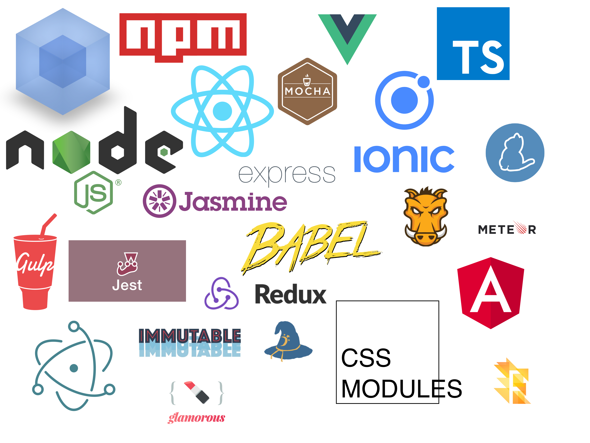

name: inverse
layout: true
class: center, middle, inverse

---

# {{{ title }}}
## {{{ subtitle }}}

.javascript-img[]

#### {{{ link }}}

---
layout: false

.left-column[
## µ-historique
]

---
count: false

.left-column[
## µ-historique
]

.right-column[
- 1995 : Création du Javascript par Brendan Eich, en 10 jours de travail

.brendan-eich-img[]
]

---
count: false

.left-column[
## µ-historique
]

.right-column[
- 1995 : Création du Javascript par Brendan Eich, en 10 jours de travail
]

.right-column-no-padding[
- Jusqu'en 1999 : Évolutions du standard ECMA-Script
]

---
count: false

.left-column[
## µ-historique
]

.right-column[
- 1995 : Création du Javascript par Brendan Eich, en 10 jours de travail
]

.right-column-no-padding[
- Jusqu'en 1999 : Évolutions du standard ECMA-Script
]

.right-column-no-padding[
- Point mort pendant 10 ans, ECMAScript 5 sort en 2009
]

???

ES5 était la version standard du Javascript pendant trèèèès longtemps (jusqu'en 2015), car pas de nouvelles fonctionnalités et le seul qu'IE supportait.
C'est d'ailleurs toujours la cible lors de la transpilation du code ES6+ pour être compris par tous les navigateurs.

---
count: false

.left-column[
## µ-historique
]

.right-column[
- 1995 : Création du Javascript par Brendan Eich, en 10 jours de travail
]

.right-column-no-padding[
- Jusqu'en 1999 : Évolutions du standard ECMA-Script
]

.right-column-no-padding[
- Point mort pendant 10 ans, ECMAScript 5 sort en 2009
]

.right-column-no-padding[
- Développement de quelques interactions sur la page
- Apparition de jQuery
- AJAX, pages sans rechargement

.jquery-logo-img[]
]

???

jQuery permet de "standardiser" les implémentations Javascript, qui étaient toutes différentes selon les navigateurs

---
count: false

.left-column[
## µ-historique
]

.right-column[
- 1995 : Création du Javascript par Brendan Eich, en 10 jours de travail
]

.right-column-no-padding[
- Jusqu'en 1999 : Évolutions du standard ECMA-Script
]

.right-column-no-padding[
- Point mort pendant 10 ans, ECMAScript 5 sort en 2009
]

.right-column-no-padding[
- Développement de quelques interactions sur la page
- Apparition de jQuery
- AJAX, pages sans rechargement
]

.right-column-no-padding[
- 2011 : Nouvelle croissance du JS, avec des frameworks SPA

.spa-logos-img[
  
  
  
]
]

???

Backbone.js en 2010, AngularJS en 2010, Ember.js en 2011
C'est AngularJS qui rafle la mise

---
count: false

.left-column[
## µ-historique
]

.right-column[
- 1995 : Création du Javascript par Brendan Eich, en 10 jours de travail
]

.right-column-no-padding[
- Jusqu'en 1999 : Évolutions du standard ECMA-Script
]

.right-column-no-padding[
- Point mort pendant 10 ans, ECMAScript 5 sort en 2009
]

.right-column-no-padding[
- Développement de quelques interactions sur la page
- Apparition de jQuery
- AJAX, pages sans rechargement
]

.right-column-no-padding[
- 2011 : Nouvelle croissance du JS, avec des frameworks SPA
]

.right-column-no-padding[
- 2013 : Envolée fulgurante et durable du JS
- 2015 : NodeJS 4
- Explosion de l'écosystème
.spa2-logos-img[

]
]

???

Angular 2 en 2016, React en 2013, Vue en 2014

---
count: false

.left-column[
## µ-historique
]

.right-column[
- 1995 : Création du Javascript par Brendan Eich, en 10 jours de travail
]

.right-column-no-padding[
- Jusqu'en 1999 : Évolutions du standard ECMA-Script
]

.right-column-no-padding[
- Point mort pendant 10 ans, ECMAScript 5 sort en 2009
]

.right-column-no-padding[
- Développement de quelques interactions sur la page
- Apparition de jQuery
- AJAX, pages sans rechargement
]

.right-column-no-padding[
- 2011 : Nouvelle croissance du JS, avec des frameworks SPA
]

.right-column-no-padding[
- 2013 : Envolée fulgurante et durable du JS
- 2015 : NodeJS 4
- Explosion de l'écosystème
]

.right-column-no-padding[
- ES2015, ES2016, ES2017+ standardisés
]

---

.left-column[
## µ-historique
## Évolution fulgurante
]

--
count: false

.right-column[
.js-ecosystem-img[

]
]

---

.left-column[
## µ-historique
## Évolution fulgurante
## Plus que le frontend
]

---
count: false

.left-column[
## µ-historique
## Évolution fulgurante
## Plus que le frontend
]

.right-column[
- Applications desktop avec Electron

.electron-img[
  

  .logos[
    
    
    
  ]
]
]

---
count: false

.left-column[
## µ-historique
## Évolution fulgurante
## Plus que le frontend
]

.right-column[
- Applications desktop avec Electron
]

.right-column-no-padding[
- Applications mobiles avec React Native & Ionic

.rn-img[
  

  .logos[
    
    
    
  ]
]
]

---
count: false

.left-column[
## µ-historique
## Évolution fulgurante
## Plus que le frontend
]

.right-column[
- Applications desktop avec Electron
]

.right-column-no-padding[
- Applications mobiles avec React Native & Ionic
]

.right-column-no-padding[
- Code natif vers Webassembly

.wasm-img[
  
]
]

---
template: inverse

# The end

### {{{ link }}}

---

.left-column[
## Sources
]

.right-column[
- Wikipédia [Javascript](https://en.wikipedia.org/wiki/JavaScript), [Brendan Eich](https://en.wikipedia.org/wiki/Brendan_Eich), [ECMAScript](https://en.wikipedia.org/wiki/ECMAScript), [jQuery](https://en.wikipedia.org/wiki/JQuery), [Backbone.js](https://en.wikipedia.org/wiki/Backbone.js), [Ember.js](https://en.wikipedia.org/wiki/Ember.js), [AngularJS](https://en.wikipedia.org/wiki/AngularJS), [React][React], [Node.js](https://en.wikipedia.org/wiki/Node.js), [Angular][Angular], [Vue.js](https://en.wikipedia.org/wiki/Vue.js)

- https://github.com/kamranahmedse/developer-roadmap
]

[React]: https://en.wikipedia.org/wiki/React_(JavaScript_library)
[Angular]: https://en.wikipedia.org/wiki/Angular_(application_platform)
